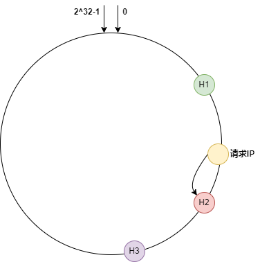

> 参考学习：https://github.com/zehuamama/balancer

## 1 概述
&emsp;&emsp;Balancer 是基于Go语言标准库 net/http/httputil 扩展的反向代理负载均衡器，它支持以下特性：
- 支持http以及https协议。
- 支持七种负载均衡算法，分别是：round-robin、random、power of 2 random choice、consistent hash、consistent hash with bounded、ip-hash、least-load。
- 支持心跳检测，故障恢复。

**net/http/httputil** 简单 DEMO：
```go
package main

import (
	"net/http"
	"net/http/httputil"
	"net/url"
)

type HTTPProxy struct {
	proxy *httputil.ReverseProxy
}

func NewHTTPProxy(target string) (*HTTPProxy, error) {
	u, err := url.Parse(target)
	if err != nil {
		return nil, err
	}
	return &HTTPProxy{httputil.NewSingleHostReverseProxy(u)}, nil
}

func (h *HTTPProxy) ServeHTTP(w http.ResponseWriter, r *http.Request) {
	h.proxy.ServeHTTP(w, r)
}

func main() {
	proxy, err := NewHTTPProxy("http:127.0.0.1:8088")
	if err != nil {

	}
	http.Handle("/",proxy)
	http.ListenAndServe(":8081", nil)
}
```
在上述代码中，HTTPProxy 是一个包含 ReverseProxy 的结构体，当我们把URL解析成 *url.URL时，则可以调用 `httputil.NewSingleHostReverseProxy` 函数为目标URL创建一个反向代理，同时HTTPProxy 需要实现 ServeHTTP 方法，这个方法可以将请求转发到实际代理的HTTP服务器中（即请求 **http:127.0.0.1:8081 被转发到 http:127.0.0.1:8088**）。
> net/http/httputil 源码解析：https://blog.51cto.com/pmghong/2506101

## 2 Balancer 中涉及到的负载均衡算法

### 2.1 round-robin
&emsp;&emsp;轮询算法是最经典的负载均衡算法之一，负载均衡器将请求依次分发到后端的每一个主机中。

### 2.2 random
&emsp;&emsp;随机算法同样也是经典的负载均衡算法，负载均衡器将请求随机分发到后端的目标主机中。

### 2.3 ip-hash
&emsp;&emsp;在 IP 哈希算法中，负载均衡器将请求根据 IP 地址将其定向分发到后端的目标主机中，代码中具体算法：通过对 IP 地址进行 CRC32 哈希计算则会得到一个 32 bit 的值，最后对主机数量进行取模，即 `CRC32(IP) % len(hosts)`，得到对应主机的索引。

### 2.4 least-load
&emsp;&emsp;Least Load 也就是最小负载算法，负载均衡器将请求定向到负载最小的目标主机中。对于最小负载算法而言，如果把所有主机的负载值动态存入动态数组中，寻找负载最小节点的时间复杂度为 O(N)，如果把主机的负载值维护成一个红黑树，那么寻找负载最小节点的时间复杂度为 O(logN)，我们这里利用的数据结构叫做**斐波那契堆**，寻找负载最小节点的时间复杂度为 O(1)。

### 2.5 power of 2 random choice
&emsp;&emsp;P2C 算法是一种工业中运用较多的负载均衡算法，它的原理很简单，它有两条基本定律：
- 若请求 IP 为空，P2C 均衡器将随机选择两个代理主机节点，最后选择其中负载量较小的节点；
- 若请求 IP 不为空，P2C 均衡器通过对IP地址以及对IP地址加盐进行 CRC32 哈希计算，则会得到两个 32 bit 的值，将其对主机数量进行取模，即`CRC32(IP) % len(hosts)` 、`CRC32(IP + salt) % len(hosts)`， 最后选择其中负载量较小的节点；

### 2.6 consistent hash
&emsp;&emsp;一致性哈希算法是一种特殊的哈希算法，当哈希表改变大小时，平均只需要重新映射 n/m 个键值，其中 n 为哈希表键值的数量，m 为哈希表槽的数量。
&emsp;&emsp;在一致性哈希负载均衡器中，一个集群由多个代理节点所组成，通过 CRC32 散列算法对代理主机节点的 UUID 或节点的 IP 地址进行计算，即`CRC32(IP)`或`CRC32(UUID)`，则会得到一组散列值，而这组散列值连成的环，称为哈希环。
&emsp;&emsp;当收到请求时，负载均衡器将请求的 IP 进行 CRC32 哈希计算进而得到一个散列值。如图所示，将代理主机节点和请求 IP 的哈希值映射到哈希环后，沿着哈希环顺时针方向查找，找到的第一个节点，即请求所被调度的代理节点。通过对代理节点的哈希值按升序建立动态数组，即可在 O(logN) 时间复杂度的情况下通过二分搜索可以找到被调度的代理节点。

<center>



</center>

&emsp;&emsp;当代理节点数量越少时，越容易出现节点的哈希值在哈希环上分布不均匀的情况。而通过引入虚拟节点的方式可以解决一致性哈希算法负载不平衡的问题 。通过对代理主机的 IP 外加虚拟序号的形式作哈希计算。如图所示 H1、H2、H3 均存在虚拟结点。

<center>


</center>


### 2.7 consistent hash with bounded
&emsp;&emsp;Google 提出的有界负载一致性哈希通过限制节点负载上限的方式解决了工作节点负载过高的问题。当节点负载过高时，有界负载一致性哈希算法通过转移热点的方式来提升集群整体的负载平衡性。即当请求 IP 的哈希值所调度的代理主机节点超过所能承受的最大负载量 M 时，负载均衡器则会按顺时针选择第一个负载量小于M 值的代理主机节点。

